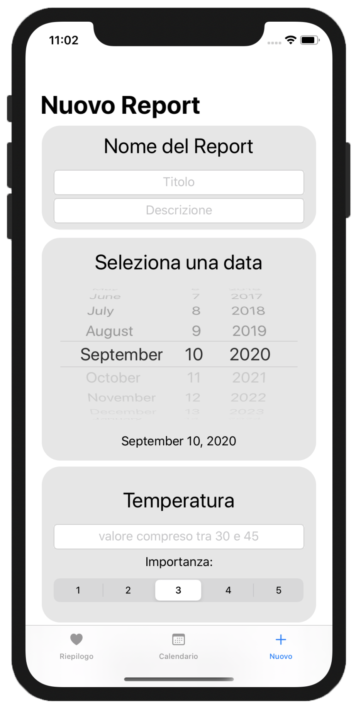

# Mobile Applications Laboratory
Computer Science, University of Bologna

## Index
1. [Personal health monitor](#personalhealthmonitor) 
  1.1 [Create and modify reports](#createandmodifyreports) 
  1.2 [Notifications](#notifications) 
  1.3 [Graphs](#graphs)
2. [Requirements](#requirements)
3. [NavigationView](#navigationView)
4. [Images](#images)

# 1. Personal health monitor 

In the following project the student is required to implement an interactive application for tracking personal information about his/her health to be saved into daily reports. In particular, the application should be able to manage the reports within a calendar, send notifications and plot the data according to specific filters.

### 1.1 Create and modify reports 

The application must be able to create, modify and delete health reports. Health reports are summaries of health information tracked by the user that should be saved every time the user thinks to be a good idea, and at least once per day. Each report must include a minimum number of two information related to the user’s health (e.g., body temperature, blood pressure, Glycemic index, etc..). Each information has an importance, i.e., an index that specifies the level of attention that requires such parameter (from 1 to 5), and each report has an optional note that can be filled with auxiliary information. Reports are stored by the application (we strongly suggest to use a database) and there must be the possibility to show reports on a daily basis, like for instance inside a calendar. In case of multiple reports for the same day, a summary report should be created, where the health information is the average of all collected data of that day. There has also to be the possibility to visualize reports according to some filters (e.g., only the reports with importance set to 5).

### 1.2 Notifications 

The application must notify the user if he/she has not inserted yet a report for that day. In this case, the user can perform the following actions: postpone the reminder (in such case the user will be asked for another time and date of the same day) or open directly from inside the notification the form for filling the report. The time in which the notification is sent by the application can be set by the user from a settings page. The application must also notify the user if the average of data collected for an information - with importance greater than 3 - in a fixed period of time has exceeded a predefined threshold. User can customize the previous parameters from a settings page, i.e., he/she can decide which information should be monitored, for how long time and what is the threshold that must not be reached.

### 1.3 Graphs 

The application should be able to collect usage stats displaying at least two graphs of any kind (pie graph, box plot, histogram, line plot, etc.) showing useful data (e.g. the variation of an health information over a week, the variation of the number of collected reports each day, etc..).

### 2. Requirements 

* iOS 13.0+
* Xcode 11+
* Swift 5.1+

### 3. NavigationView 
<figure>
    
</figure>

### 4. Images 

   
      
           
   
      
           
   
      
           
   
      
           
   
      
           
   
      
           

